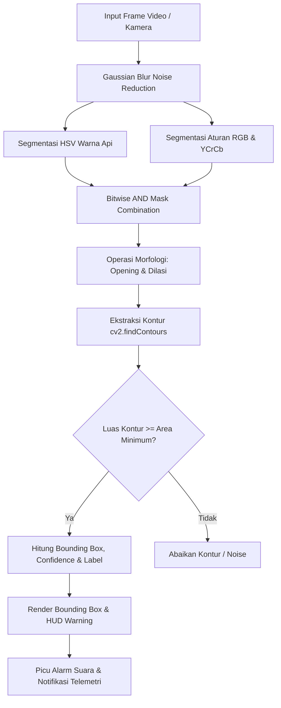

# DOKUMENTASI PROYEK: SISTEM DETEKSI API REAL-TIME (FLAMEVISION AI)

---

## 📌 Informasi Identitas

- **Judul Proyek:** Sistem Deteksi Api Real-Time Berbasis Computer Vision (Python, OpenCV & Web Dashboard)
- **Nama Pengembang:** Diva Aurel Anastacia Sirait
- **Kategori:** Computer Vision / Pengolahan Citra Digital / IoT & Keamanan

---

## 📖 Deskripsi Project

**Sistem Deteksi Api Real-Time (*FlameVision AI*)** adalah sebuah aplikasi perangkat lunak berbasis *Computer Vision* yang dirancang untuk mengenali dan mendeteksi keberadaan kobaran api (*fire/flame*) secara otomatis, akurat, dan *real-time* dari berbagai sumber video visual. Sumber input dapat berasal dari kamera bawaan laptop/webcam, kamera smartphone (*cross-platform WebRTC*), maupun file rekaman video pemantauan.

Sistem ini menggabungkan teknik segmentasi citra multi-ruang warna (**Dual Color-Space Segmentation: HSV dan RGB/YCrCb**) dengan operasi morfologi citra dan analisis kontur (*contour analysis*). Berbeda dengan metode pendeteksian sensor panas konvensional yang memerlukan kontak langsung atau suhu ruangan meningkat drastis, sistem berbasis kamera ini mampu mendeteksi api pada fase awal (*early fire warning*) dari jarak jauh (*non-contact detection*).

Aplikasi ini hadir dalam **dua antarmuka pengguna**:
1. **Aplikasi Desktop Interaktif (OpenCV GUI)**: Dilengkapi dengan *Heads-Up Display* (HUD), *bounding box* dinamis, slider kalibrasi parameter sensitivitas (*trackbars*), dan alarm audio bawaan Windows (`winsound`).
2. **Web Dashboard Real-Time (Flask + HTML5 WebRTC)**: Memungkinkan perangkat apa pun (PC, smartphone Android/iOS, tablet) di dalam jaringan untuk membuka antarmuka pemantauan melalui browser, mengaktifkan kamera perangkat secara langsung, serta melihat telemetri deteksi dan alarm sirene secara simultan.

---

## 🎯 Tujuan Project

1. **Pendeteksian Dini Kebakaran (*Early Fire Detection*)**:
   Menyediakan sistem peringatan dini yang mampu mengenali kobaran api sejak detik pertama muncul di area pantauan kamera, sebelum api membesar dan memicu kebakaran fatal.

2. **Deteksi Tanpa Sentuh (*Non-Contact Remote Monitoring*)**:
   Menggantikan atau melengkapi detektor asap/panas konvensional dengan pemantauan visual jarak jauh pada area luas (seperti gudang, laboratorium, dapur, atau ruang server).

3. **Mereduksi *False Positive* (Deteksi Palsu)**:
   Mengimplementasikan algoritma filter ganda berbasis spektrum warna dan luminansi untuk membedakan kobaran api asli dari objek biasa berwarna jingga/kuning seperti lampu, dinding, atau warna kulit.

4. **Aksesibilitas Multi-Perangkat (*Cross-Platform Accessibility*)**:
   Memfasilitasi pengguna untuk menggunakan kamera dari smartphone atau laptop mana pun yang membuka website tanpa perlu instalasi aplikasi khusus di perangkat klien.

5. **Antarmuka Kalibrasi & Telemetri Lengkap**:
   Menyediakan metrik *live telemetry* (*confidence score*, jumlah titik api, *frame rate/FPS*) dan panel kalibrasi sensitivitas warna dinamis (*real-time parameter tuning*).

---

## 🧠 Arsitektur & Cara Kerja Algoritma

Sistem memproses setiap *frame* video melalui tahapan *pipeline* pengolahan citra berikut:



### 1. Penghalusan Citra (*Gaussian Smoothing*)
Mengurangi *noise* sensor dan artefak kompresi piksel menggunakan filter Gaussian dengan *kernel* ukuran ganjil ($k = 15$).

### 2. Segmentasi Ruang Warna Ganda
- **Ruang Warna HSV (*Hue, Saturation, Value*)**:
  Mengekstrak rentang spektrum api:
  $$\text{Hue} \in [0, 25], \quad \text{Saturation} \in [100, 255], \quad \text{Value} \in [190, 255]$$
- **Karakteristik RGB & YCrCb**:
  Api memiliki intensitas merah yang dominan dan luminansi tinggi:
  $$R > G + 15, \quad G > B + 10, \quad R > 150$$
  $$Cr > Cb + 10, \quad Y > 100$$

### 3. Operasi Morfologi & Pembersihan Mask
- **Morphological Opening**: Menghilangkan partikel titik-titik kecil (*salt-and-pepper noise*).
- **Morphological Dilation**: Menghubungkan lidah-lidah api yang terpisah agar membentuk satu kontur solid.

### 4. Ekstraksi Kontur & Bounding Box
Menghitung luas area kontur ($Area \ge 600\text{ px}$) dan kepadatan piksel (*pixel density*) di dalam *bounding box* $(x, y, w, h)$ untuk menghitung tingkat kepercayaan (*confidence percentage*).

---

## 💻 Fitur-Fitur Utama

| Fitur | Keterangan |
| :--- | :--- |
| **Real-Time Bounding Box** | Kotak pembatas merah menyala dengan aksen sudut HUD dan badge bertuliskan `FIRE DETECTED (%)`. |
| **Visual Status Banner** | Banner status pemantauan: `[STATUS: NORMAL]` (Hijau) atau `[!] WARNING: FIRE DETECTED` (Merah). |
| **Web Audio Siren Alarm** | Sirene peringatan otomatis berbasis Web Audio API dan Windows `winsound`. |
| **Split-Screen Debug Mode** | Mode tampilan berdampingan untuk menganalisis hasil filter *Inferno Color Map*. |
| **Mobile Browser Camera** | Akses kamera smartphone depan/belakang via HTML5 WebRTC. |
| **Dynamic Calibration** | Slider untuk mengubah parameter $H, S, V$ dan ukuran area kontur secara *real-time*. |
| **Snapshot Capture** | Tangkapan layar otomatis/manual ke dalam folder `snapshots/` dan galeri web. |
| **Simulasi Terintegrasi** | Dilengkapi video simulasi kobaran api (`sample_fire.mp4`) untuk pengujian aman. |

---

## 📁 Struktur Direktori Proyek

```text
├── src/
│   ├── __init__.py          # Inisialisasi paket Python
│   ├── detector.py          # Logika deteksi api (HSV, RGB, YCrCb, kontur)
│   ├── utils.py             # Anotasi bounding box, HUD status, dan audio alarm
│   └── app.py               # Controller aplikasi desktop OpenCV & loop video
├── templates/
│   └── index.html           # Tampilan Web Dashboard & WebRTC Camera
├── static/
│   └── style.css            # Desain antarmuka responsif & dark glassmorphism
├── tests/
│   ├── __init__.py
│   └── test_detector.py     # Unit test deteksi api otomatis
├── main.py                  # Titik masuk aplikasi desktop GUI
├── web_app.py               # Server Web Dashboard Flask
├── generate_test_video.py   # Generator video simulasi api sintetis
├── sample_fire.mp4          # File video simulasi api
├── run.bat                  # Launcher 1-klik untuk Aplikasi Desktop
├── run_web.bat              # Launcher 1-klik untuk Web Dashboard
├── requirements.txt         # Daftar pustaka: opencv-python, numpy, flask
├── README.md                # Panduan instalasi dan penggunaan cepat
└── docs/
    ├── PROJECT_DESCRIPTION.md   # Ringkasan singkat proyek
    └── PROJECT_DOCUMENTATION.md # Dokumentasi teknis lengkap proyek
```

---

## 🚀 Cara Menjalankan Sistem

### 1. Menjalankan Web Dashboard (Akses dari Laptop/HP)
Klik ganda file **`run_web.bat`** atau jalankan perintah:
```bash
python web_app.py --port 5000
```
- Akses di laptop: **`http://localhost:5000`**
- Akses dari HP di Wi-Fi yang sama: **`http://192.168.50.20:5000`**

### 2. Menjalankan Aplikasi Desktop (OpenCV Native Window)
Klik ganda file **`run.bat`** atau jalankan perintah:
```bash
# Menggunakan webcam bawaan
python main.py

# Menggunakan video simulasi api
python main.py --source sample_fire.mp4
```

---

## 🔬 Kesimpulan

Proyek **Sistem Deteksi Api Real-Time (*FlameVision AI*)** yang dikembangkan oleh **Diva Aurel Anastacia Sirait** berhasil membuktikan bahwa teknik *Computer Vision* berbasis segmentasi warna ganda (HSV & YCrCb) dan pengolahan morfologi mampu mendeteksi api secara cepat, andal, dan minim *false positive* pada lingkungan komputasi ringan tanpa memerlukan perangkat keras khusus/GPU berdaya tinggi.
